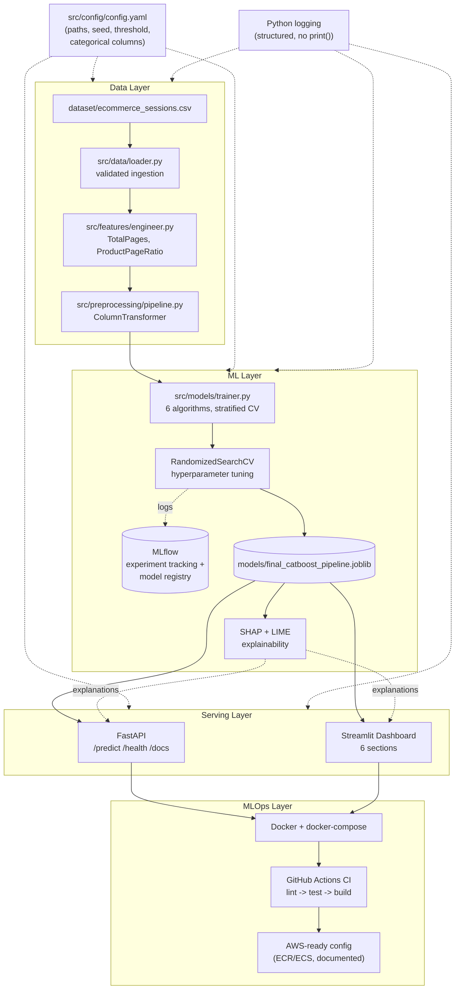
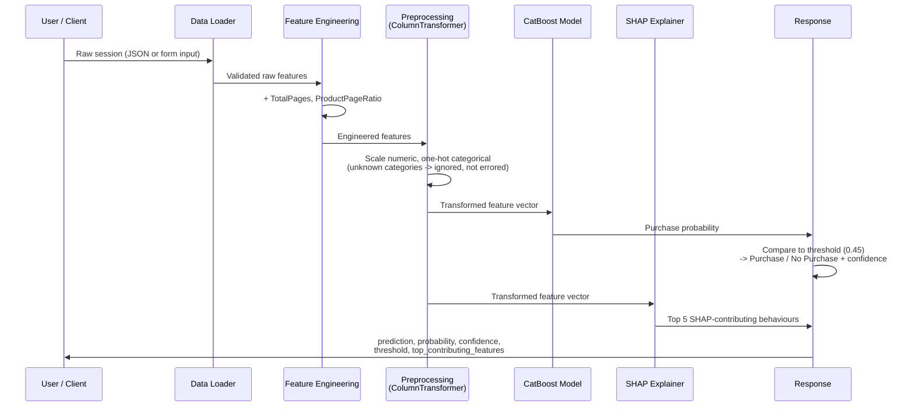

# System Architecture & Workflow

Two diagrams: the overall system architecture (§6 of the project brief) and
the workflow a single session follows from raw data to an explained
prediction. Both render directly in GitHub's markdown viewer.

---

## 1. System architecture

Four layers — data, ML, serving, MLOps — with configuration and logging
cutting across all of them via `src/config/config.yaml` and Python's
`logging` module.

---

## 2. Workflow: one session, start to finish

Traces a single session from a raw CSV row to a scored, explained response —
the same path whether it's served through the API or the dashboard.

---

## Notes

- Both diagrams describe the *actual* implemented system — they are not
  aspirational. The dashed lines in the architecture diagram (config,
  logging, MLflow) indicate cross-cutting concerns rather than a
  data-flow direction.
- The workflow diagram applies identically to the FastAPI `/predict`
  endpoint and the Streamlit "Live Session Scoring" section — both call the
  same `src/` code (`engineer_features`, the saved pipeline, and the SHAP
  explainer), which is why their outputs are verified to match exactly for
  the same input (see `docs/model_card.md`).
